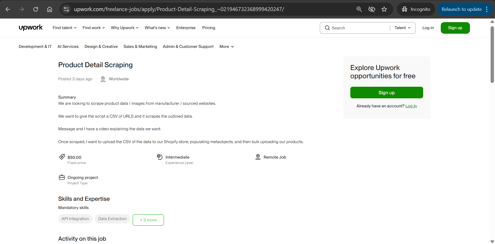

# WebScrapping

WebScrapping is a data extraction automation tool built to scrape product information from e-commerce websites. It focuses on collecting structured data such as product names, descriptions, prices, images, and URLs. The output can be exported in CSV format for use in reports, analysis, or other integrations.

## Table of Contents

- [Introduction](#introduction)
- [Features](#features)
- [Installation](#installation)
- [Usage](#usage)
- [Contributing](#contributing)
- [License](#license)

## Introduction
WebScrapping is a Java-based web automation project that simulates browsing and interacting with online stores to extract real-time product data. It's built using Selenium WebDriver and TestNG and is ideal for use in automated testing, data collection, or learning purposes. Scraped data is automatically stored in a CSV file named after the current date.
## Features
- **Automated Data Extraction**: Scrape product data like name, description, price, and URL from any structured product catalog.
- **CSV Export**: Export scraped data into a clean CSV format with optional total price row and timestamp.
- **Dynamic File Naming**: Each export is saved under a file named after the current date.
- **Page Navigation**: Handles page interactions such as scrolling, filtering, or clicking through categories.
- **Reusable Utility Methods**: Built-in helpers for writing and formatting CSV files.

## Installation
To set up the WebScrapping project locally, follow these steps:

 1. Clone the repository
* git clone https://github.com/SalmaMamdouh12/WebScrapping.git

2. Navigate to the project directory:
*   cd WebScrapping

3. Install dependencies:
*   npm install

4. Configure the application:
* Update configuration files with necessary settings.

5. Run the application:
*   npm start

## Usage
* User Guide: Refer to the User Guide for detailed information on how to use the WebScrapping application.
## 

## Contributing
* We welcome contributions from the community. To contribute to WebScrapping, follow these steps:
1. Fork the repository.
2. Create a new branch for your feature or bug fix.
3. Make your changes with clear commit messages.
4. Push your changes and open a Pull Request.
5. Please follow the existing code style and include tests where applicable.

## License
* WebScrapping is licensed under the MIT License. See the LICENSE file for more details.